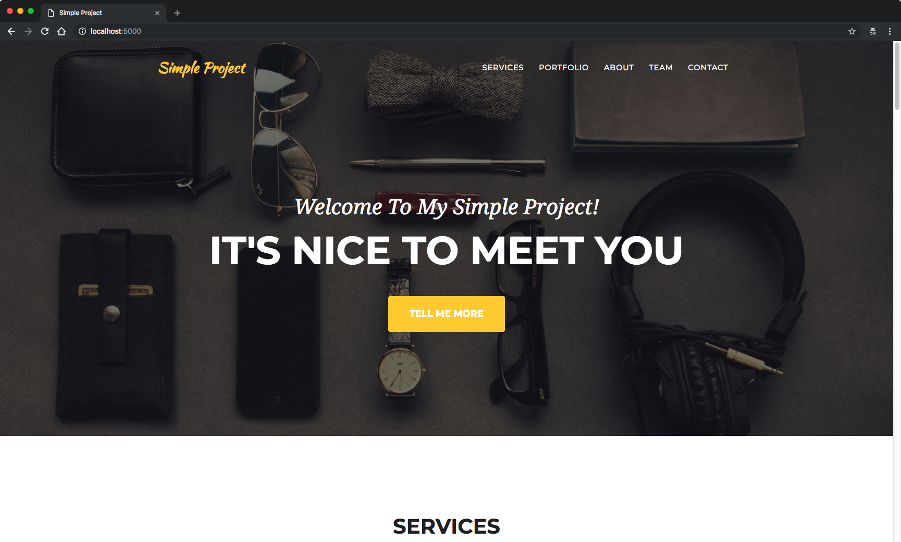

# FMMI Simple Project
 > This is a simple project to demonstrate how to build a simple Flask RESTful API with Docker-Compose.

 Based on the work of https://github.com/Krlier



## What is this project about?

This is the project that was used to create the tutorial on how to create a simpleFlask RESTful API with Docker-Compose.
The tutorial on Medium is available [here].

## Requirements

To build this project you will need [Docker][Docker Install] and [Docker Compose][Docker Compose Install].

## Deploy and Run

After cloning this repository, you can type the following command to start the simple app:

```sh
make install
```

Then simply visit [localhost:5000][App] !

## Clone Repository
git clone https://github.com/FranciscoGutierrez/SimpleProject

## Generate docker image locally with docker compose:
make install

> Please check MakeFile for all the details. Also check /deployments folder here you can set up everything.

## Save Image Locally:
docker save -o ./docker-image.tar simple-app

## Send to the server:
scp -P 2222 docker-image.tar student@picasso.experiments.cs.kuleuven.be:~
<use-your-password>

## Load the Docker Image:
podman load --input docker-image.tar

## Check the Loaded Image:
podman images

Run image
podman run localhost/simple-app-frank

Live demo running on picasso: http://192.31.23.25:4000/

Questions?

- robin.decroon@kuleuven.be
- francisco.gutierrez@kuleuven.be


[Docker Install]:  https://docs.docker.com/install/
[Docker Compose Install]: https://docs.docker.com/compose/install/
[App]: http://127.0.0.1:5000
[here]: https://medium.com/@daniel.carlier/how-to-build-a-simple-flask-restful-api-with-docker-compose-2d849d738137
